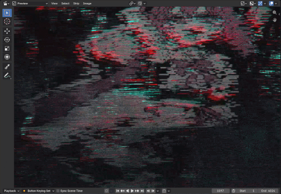
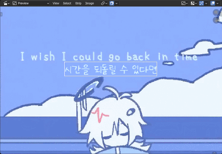
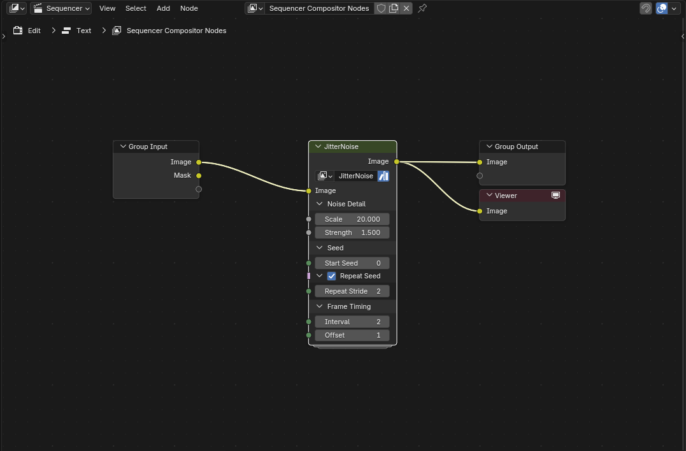

# VSENodeGroups
개인용으로 쓰려고 만든 영상편집용 블렌더 노드그룹. 만들때마다 추가할꺼임

# How to Use
1. `Blender 5.0+` 설치.
2. `File` - `Link` or `Append` - .blend file 선택 후 `NodeTree` 내에서 가져올 노드그룹 선택
 **또는** `%USERPROFILE%\Documents\Blender\Assets` 경로에 .blend file 삽입
3. `Video Sequencer` timeline 에서, 효과를 적용할 **Strip** 선택.
4. Strip Modifier 에서 `Compositor` 추가.
5. `Composite` 창 열고, `Node Tree Sub-Type` 를 `Sequencer`로 변경. (기본값은 `Scene`임.)
6. `Asset Library` 로부터 효과 노드그룹을 불러와 사용.

# List
- [ColorizeTP](.blend/ColorizeTP.blend) : 대상 영역에 Background Color 기반의 Colorize 효과
- [JitterNoise](.blend/JitterNoise.blend) : 노이즈 노드 및 Scene Frame 기반의 Jitter 효과

# Example
> 선택된 박스 부분이 적용된 부분. 이름 클릭을 통해 예시 노드 세팅값 확인 가능.
<table width="100%">
  <tr>
    <td width="50%" align="center">
      
    </td>
    <td width="50%" align="center">
      
    </td>
  </tr>
  <tr>
    <td align="center">
        

            
ColorizeTP

            
        

    </td>
    <td align="center">
        

            
JitterNoise

            
        

    </td>
  </tr>
</table>
